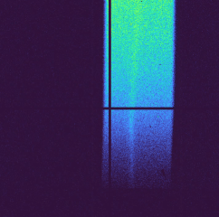

# FishingROD

**Version:** v2.2  
**Maintained by:** Nikoo Ghanadan

A Python tool for processing GID (Grazing Incidence Diffraction) data from MaxiPix detectors. The script identifies peak images in Q-space, sums them while using non-peak images as background, and performs Gaussian fitting on the resulting data.



---

## Table of Contents

- [About](#about)
- [Features](#features)
- [Built With](#built-with)
- [Getting Started](#getting-started)
  - [Prerequisites](#prerequisites)
  - [Installation](#installation)
- [Usage](#usage)
  - [Configuration](#configuration)
  - [Running the Script](#running-the-script)
- [API Reference](#api-reference)
- [Roadmap](#roadmap)
- [License](#license)
- [Contributing](#contributing)
- [Contact](#contact)

---

## About

This Python script processes GID data collected using the MaxiPix detector. It identifies images in a scan containing peaks in the desired Q-space region, sums them, and uses images without peaks as background. The results include:

- Summed 2D maps
- Animated GIF/MP4 of all processed images
- 1D curves converted from 2D images with Gaussian fitting

---

## Features
- Conversion from pix/degrees to reciprocal space (q)
- Automatic rod/peak detection in Q-space
- Background subtraction using non-peak images
- Hot/dead pixel masking
- Scattering background removal
- Gaussian fitting with FWHM calculation
- Export results as images, GIFs, and MP4s

---

## Built With

- **Python** (≥3.6)
- **h5py** - HDF5 file handling
- **matplotlib** - Visualization
- **scipy** (< 1.14) - Scientific computing
- **scikit-learn** - Machine learning utilities
- **imageio** - Image I/O
- **lmfit** - Curve fitting

---

## Getting Started

### Prerequisites

Ensure you have Python 3.6 or higher installed on your system.

**Verify your Python installation:**

```bash
python --version
```

### Installation

1. Clone the repository:
```bash
git clone <https://github.com/Nikoo-Ghn/FishingROD>
cd FishingROD
```

2. Install required dependencies:
```bash
pip install h5py matplotlib scipy scikit-learn imageio lmfit
```

**Note:** Ensure scipy version is < 1.14

---

### Running the Script

Execute the script with your configuration file from terminal:

```bash
python FishingROD.py --config example_config
```

### Configuration

Edit the `config.py` file with your experimental parameters:

| Parameter | Description | Example |
|-----------|-------------|---------|
| `scan_name` | Name of the scan | `"scan_001"` |
| `path_to_files` | Directory containing HDF5 files | `"/data/scans/"` |
| `sample_name` | Sample identifier | `"hBN_on_SolidCu1"` |
| `energy` | X-ray energy (keV) | `22.5` |
| `SDD` | Sample-Detector Distance (mm) | `500.0` |
| `PixS` | Detector pixel size (mm) | `0.055` |
| `PY0` | Direct beam Y position (pixels) | `256` |
| `PX0` | Direct beam X position (pixels) | `256` |
| `wqxy` | Qxy display window (Å⁻¹) | `(0, 10)` |
| `rod_qxy` | Expected rod location in Qxy (Å⁻¹) | `2.5` |
| `wqz` | Qz window for peak finding (Å⁻¹) | `(0.5, 3.0)` |
| `Icutoff` | Peak detection threshold | `100` |
| `bg_lim` | Background selection limit (fraction of `Icutoff`) | `0.3` |
| `bg2` | Background subtraction bounds (Å⁻¹) | `(0.1, 0.5)` |
| `gaus_w` | Gaussian fit bounds in Qz (Å⁻¹) | `(1.0, 2.0)` |
| `mask_range` | Area to mask `{'qxy': (min, max), 'qz': (min, max)}` | `{'qxy': (0, 0), 'qz': (0, 0)}` |

**Tip:** Start with `wqxy = (0, 10)` if the range is unknown, then narrow down based on initial results.

---

## API Reference

### `q_to_pixel(q_arr, q_val)`
Converts a Q-space value to the nearest pixel index.

**Parameters:**
- `q_arr` (array): Monotonic array of Q-values
- `q_val` (float): Target Q value

**Returns:**
- `idx` (int): Pixel index closest to target Q value

---

### `get_data(cfg)`
Opens HDF5 file and retrieves raw data, direct beam positions, and Q-space arrays.

**Parameters:**
- `cfg` (dict): Configuration dictionary

**Returns:**
- `f`: HDF5 file object
- `Data0`: Raw detector images
- `PY0`, `PX0`: Direct beam positions
- `qxy`, `qz`: Q-space coordinate arrays
- `nxc`, `nyc`: Image dimensions
- `delta0`, `gam0`, `mu0`: Instrument angles (degrees)

---

### `deadpix(cfg, Data0)`
Creates a mask for hot pixels, dead pixels, or detector cracks.

**Parameters:**
- `cfg` (dict): Configuration dictionary
- `Data0` (array): Raw data

**Returns:**
- `deadpix_mask` (array): Boolean mask of pixels to exclude

---

### `sum_peaks(Data0, qxy, qz, th, cfg)`
Main peak detection function. Processes scans to build summed images for rod signal and background.

**Parameters:**
- `Data0` (array): Raw detector data
- `qxy`, `qz` (array): Q-space coordinates
- `th` (array): Angles
- `cfg` (dict): Configuration dictionary

**Returns:**
- `map2D_peakonly` (array): 2D map of summed peak images with background subtraction
- `p` (int): Number of images summed

---

### `remove_scattering(map2D, qxy, cfg)`
Removes scattering by subtracting a background line computed from rows in the window defined by `cfg["bg2"]`.

**Parameters:**
- `map2D` (array): Input 2D map
- `qxy` (array): Qxy coordinates
- `cfg` (dict): Configuration dictionary

**Returns:**
- `map2D_bkgr` (array): Background-subtracted 2D map

---

### `gaussian_fit(map2D_bkgr, qz, qxy, cfg)`
Sums the 2D map over a Qz range and fits the resulting Qxy profile to a Gaussian plus constant model.
This fit also takes into consideration your measurement slit (=1px)

**Parameters:**
- `map2D_bkgr` (array): Background-subtracted 2D map
- `qz`, `qxy` (array): Q-space coordinates
- `cfg` (dict): Configuration dictionary

**Returns:**
- `result`: Fit result object
- `mean_q` (float): Gaussian center
- `sigma_q` (float): Gaussian width
- `fwhm_q` (float): Full width at half maximum
- `x_fit`, `y_fit` (array): Fit curve data
- `flatten_line` (array): Flattened data used for fitting

---

### `mask_rectangle(image, cfg)`
Applies a rectangular mask to an image based on ranges defined in configuration.

**Parameters:**
- `image` (array): 2D image array
- `cfg` (dict): Configuration dictionary with `'mask_range'` key containing `'x': (x_min, x_max)` and `'y': (y_min, y_max)`

**Returns:**
- `masked_image` (array): Image with masked region set to 0

---

### `save_as_gif(peak_images, gif_filename, cmap, duration)`
Converts 2D arrays to RGB frames and saves as an animated GIF.

**Parameters:**
- `peak_images` (list): List of 2D image arrays
- `gif_filename` (str): Output filename
- `cmap` (str): Matplotlib colormap name
- `duration` (float): Frame duration in seconds

---

### `save_as_mp4(peak_images, mp4_filename, cmap, duration)`
Converts 2D arrays to RGB frames and saves as an MP4 video.

**Parameters:**
- `peak_images` (list): List of 2D image arrays
- `mp4_filename` (str): Output filename
- `cmap` (str): Matplotlib colormap name
- `duration` (float): Frame duration in seconds

---

## Roadmap

- [x] Code cleanup and optimization
- [x] Remove empty values
- [x] Add easy implementation for peak finding
- [x] Move remaining parameters into config
- [x] Save config with results
- [x] Improve documentation with examples
- [ ] Add support for additional detector types

---

## License

This project is maintained by ESRF (European Synchrotron Radiation Facility). The script and its accompanying files are the intellectual property of ESRF.

---

## Contributing

Contributions are welcome! If you'd like to contribute to this project, please reach out.

**Contributors:**
- Nikoo Ghanadan
- Thomas Sarrazin

---

## Contact

For questions or further information, please contact:

**Nikoo Ghanadan**  
Email: Nikoo.Ghanadan@esrf.fr

---

<p align="right"><a href="#readme-top">↑ Back to top</a></p>
